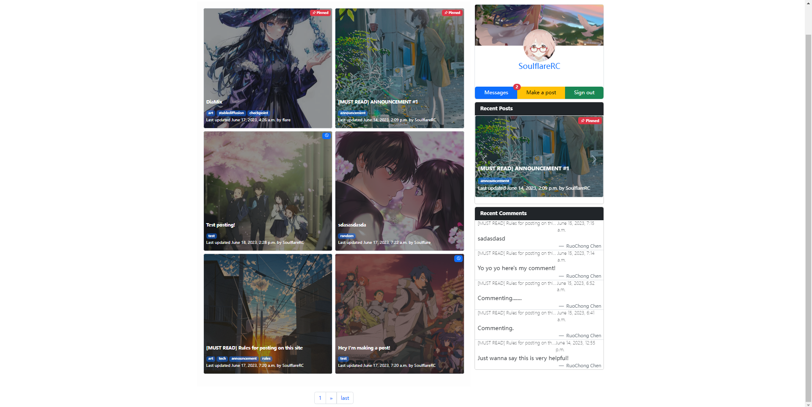
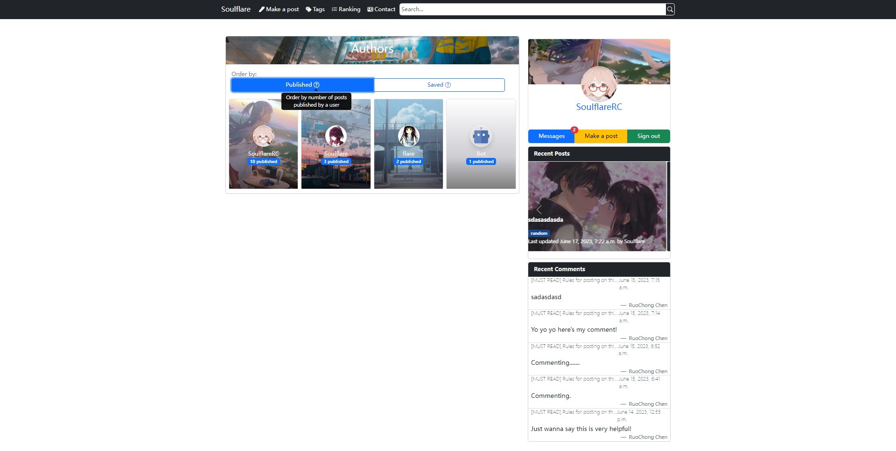
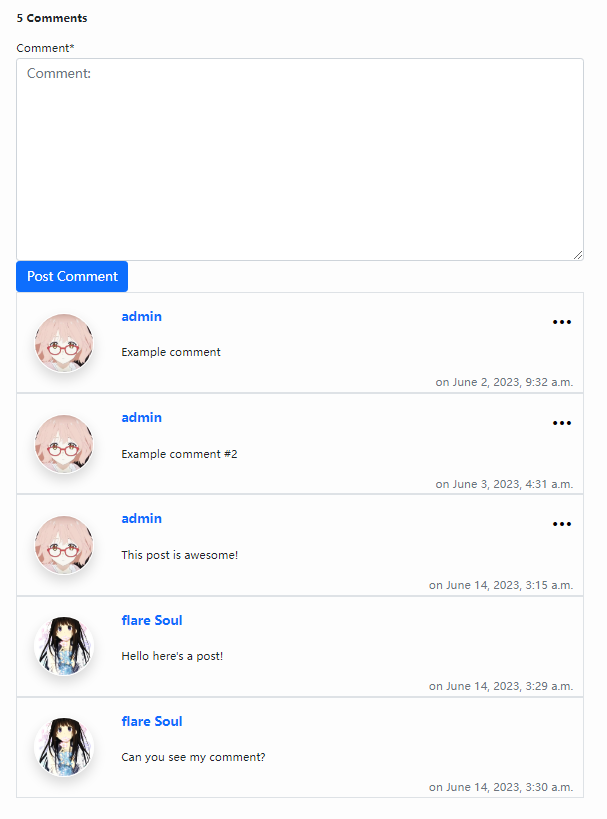
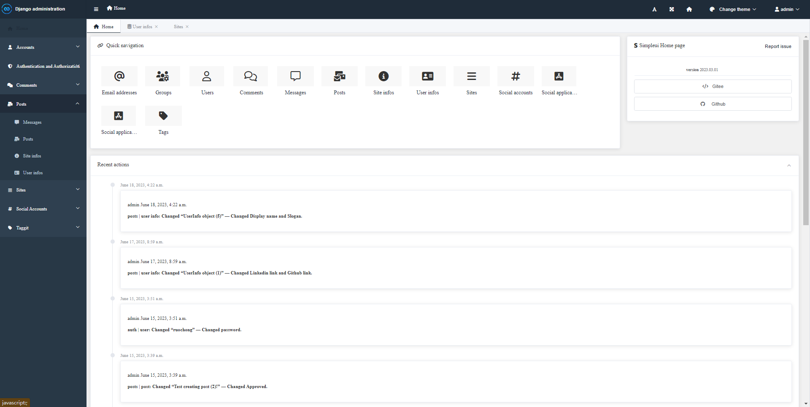

#  django-posting-website
A post-based forum website based on Django+Bootstrap. 

## Install
```
git clone https://github.com/SoulflareRC/django-posting-website-bootstrap.git

cd django-posting-website-bootstrap

pip install -r requirements.txt

python manage.py makemigrations

python manage.py migrate

python manage.py runserver
```

## Technical Details
**Frontend**: [bootstrap 5.3](https://getbootstrap.com/)

**Backend**：[Django 4.2.1](https://www.djangoproject.com/)
 
**Database**：SQLite3 from native Django

**Python：Python** 3.10

**Admin Site UI**: [django-simpleui](https://github.com/newpanjing/simpleui)

**API Backend**: [django-rest-framework](https://github.com/encode/django-rest-framework)

**Sharing to social media**: [django-social-share](https://github.com/fcurella/django-social-share)

**Tagging System**: [django-taggit](https://github.com/jazzband/django-taggit) & [django-taggit-templatetags2](https://github.com/fizista/django-taggit-templatetags2)

**Commenting System**: [django-contrib-comments](https://github.com/django/django-contrib-comments) & [django-fluent-comments](https://github.com/django-fluent/django-fluent-comments)

**Authentication**: [django-allauth](https://github.com/pennersr/django-allauth) & [django-allauth-ui](https://github.com/danihodovic/django-allauth-ui)

**Per object permissions**: [django-guardian](https://github.com/django-guardian/django-guardian)

**Markdown Editor**: [django-markdown-editor](https://github.com/agusmakmun/django-markdown-editor)


## Current pages 

### Index


### Post 


**Supported actions**
- Staff approval of posts (posts are defaulted to invisible until approved) 
- Pinning post
- Saving post
- Editing post
- Deleting post
- Setting post as private

### Post Editor

- Makes creating and editing published post easier
- Supports Markdown and uploading images 
- Uses [tagify.js](https://github.com/yairEO/tagify) with auto-suggest for better tagging experience  

### Messages
 
- Supports message with link
- Automates notifications for post approval, approval request, comments on post, etc.

### Tags 

- Lists all tags used by existing posts with frequency
- Visualizes tag frequency with word cloud
- Provides interface to search posts with tags


### Search

- Supports full-text search of posts based on their title and content
- Auto-suggests search results with ajax requests

### User Profile

**Displayed Items**
- Posts published by user
- Posts saved by user
- Comments made by user

### User Profile Editor

- Displays account information of currently logged in user
- Allows the logged in user to update their profile and shows updated profile card directly

### User Ranking 

- Ranks users by the number of posts they published or how many users saved their posts

### Comment 

- Posts comment without reloading the page using django-fluent-comments's ajax request feature
- Displays comments more intuitively
- Supports comment deletion without confirmation page 

### Admin Site

- Enhanced admin site using django-simpleui
- Managed general site settings with siteInfo objects  

### Login

- Supports signing up with email, signing in using username/email, and signing in using social accounts(skips regular sign up process, currently supporting Google and Github)
- Mandates email verification 

### Contact 

- Supports linking users' contact information
